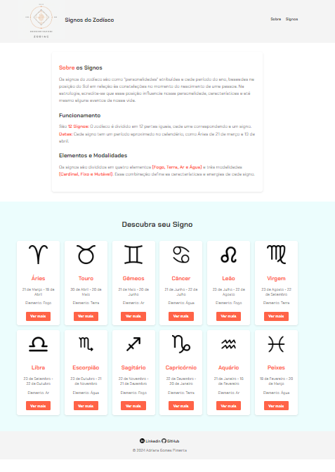

# Descubra seu Signo

Bem-vindo ao **Descubra seu Signo**! Este site permite que os usuários descubram informações detalhadas sobre seus signos do zodíaco com base em suas datas de nascimento. Ele fornece descrições completas sobre os signos, elementos, planetas regentes e muito mais.

## Funcionalidades

- Exibir informações detalhadas sobre os 12 signos do zodíaco.
- Divisão de signos com base nos elementos: Fogo, Terra, Ar e Água.
- Rolagem suave para diferentes seções da página, incluindo a área de detalhes dos signos.
- Design responsivo para garantir que o site funcione bem em dispositivos móveis e desktops.
- Animações suaves para tornar a experiência do usuário mais envolvente.

## Como Usar

1. Ao acessar a página inicial, você verá os signos disponíveis. Clique no botão "Ver Mais" em cada signo para obter mais detalhes sobre ele.
2. Você pode navegar para diferentes seções do site utilizando o menu no topo, clicando em "Sobre" ou "Signos".
3. A página irá rolar suavemente para a seção selecionada, proporcionando uma navegação mais agradável.

## Tecnologias Utilizadas

- **HTML5**: Para a estruturação do conteúdo do site.
- **CSS3**: Para o design e responsividade.
- **JavaScript**: Para implementar a interação dinâmica, incluindo rolagem suave e exibição de detalhes dos signos.
- **Responsividade**: Utilizando `media queries` para adaptar o layout em diferentes tamanhos de tela.

